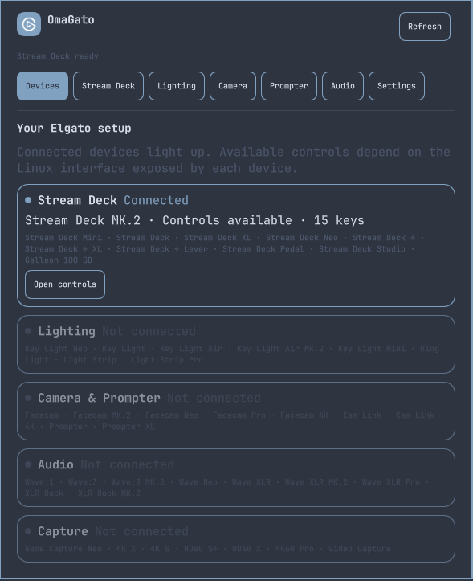

# OmaGato

Control your Elgato setup from the Omarchy bar. OmaGato brings Stream Deck keys, lights, cameras, audio, and a teleprompter into one panel that follows your Omarchy theme.



## Highlights

- Stream Deck: Click + to assign an installed app or system action to a key. Add scripts, websites, media controls, macros, and pages. Right click a key to clear it with confirmation.
- Your look: Choose from four Omarchy inspired icon themes, use your own images, and style empty keys. The interface follows your system language or a language you choose.
- More Elgato gear: Control compatible lights, adjust camera controls exposed by Linux, manage audio levels, and run a native Prompter view. [OpenXLR](https://github.com/emaspa/openxlr) adds controls for supported Wave and XLR devices.

## Install

```bash
omarchy plugin add https://github.com/JustVicinity/omagato
~/.config/omarchy/plugins/io.github.justvicinity.omagato/install.sh
```

The installer creates a Python environment and starts OmaGato's user service. You need Python 3 with `venv` and `pip`. Some functions use optional system tools: `v4l2-ctl` for cameras, `avahi-browse` for light discovery, and `wpctl` for audio. Media keys use `playerctl` when available or the system MPRIS bus. A physical Prompter needs a working display connection under Hyprland.

If a Stream Deck is detected but cannot be opened, run `./setup-usb-access.sh` from the plugin directory to install the included USB access rule. That step asks for `sudo`.

## Update or remove

After `omarchy plugin update io.github.justvicinity.omagato`, run `install.sh` again to update the Python environment and service.

To remove OmaGato, run `uninstall.sh` in the plugin directory, then `omarchy plugin remove io.github.justvicinity.omagato`. Your key layouts and imported icons remain in `~/.config/omarchy-elgato/`. Use `uninstall.sh --purge-config` if you also want to delete them.

## Device support

OmaGato was tested with a Stream Deck MK.2. We could not physically test every Elgato model; controls for other devices depend on the interfaces they expose on Linux. The [device and feature matrix](docs/compatibility.md) shows what is implemented and what still needs testing or development. Reports from owners of other models are welcome.

OmaGato is an independent community project, not official Elgato software. Its code is MIT licensed. The Elgato glyph comes from the [MIT licensed Elgato Icons project](https://github.com/elgatosf/icons); its license is included in `assets/brand/LICENSE.elgato-icons`. OpenXLR is a separate, optional application and is not bundled.
